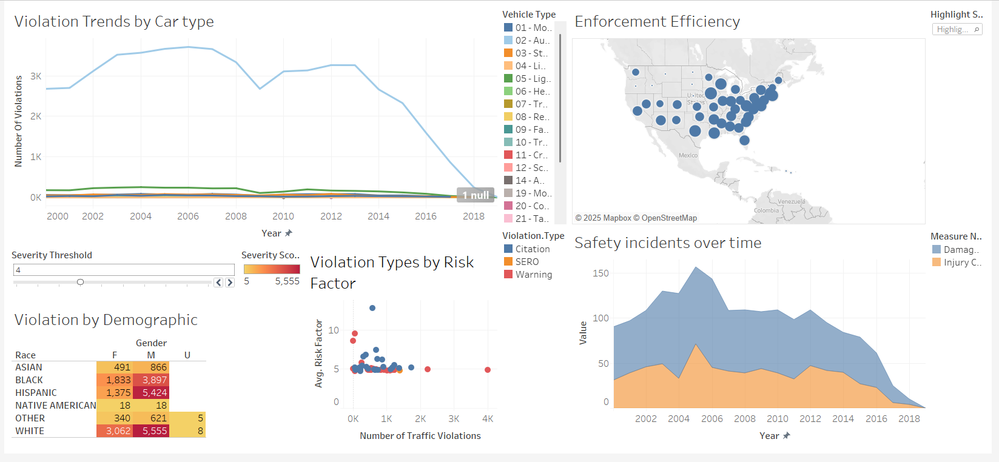
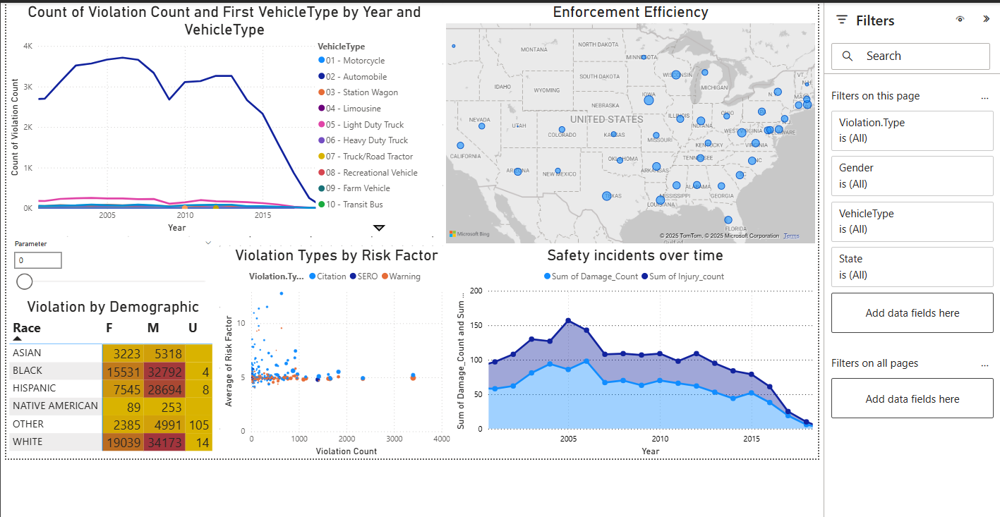

# Traffic Violation Data Visualization Project

## Description

This project explores and compares the capabilities of **Tableau** and **Power BI** in visualizing a multi-dimensional traffic violation dataset. The goal is to evaluate the **strengths**, **limitations**, and **usability** of both tools for building interactive dashboards that uncover insights for traffic control agencies.

The dataset includes detailed attributes such as violation type, location, driver demographics, vehicle type, and severity of the incident. Dashboards were built in both tools to visualize trends, risk factors, demographic patterns, and enforcement efficiency across the United States.

---

## Key Features

### Tableau Dashboard Highlights:

* Drag-and-drop design
* Automatically recognizes state locations
* Dynamic filtering with a Severity Threshold parameter
* Visuals include:

  * Violation Trends by Car Type
  * Enforcement Efficiency Map
  * Violation by Demographic (Race & Gender)
  * Safety Incidents Over Time
  * Violation Types by Risk Factor

### Power BI Dashboard Highlights:

* Formula-driven design with DAX
* Parameter implementation using separate tables & relationships
* Manual mapping configuration
* Equivalent visuals to Tableau for fair comparison

---

## Visual Comparisons

### Tableau Example:

### Power BI Example:

---

## Key Learnings

* Tableau excels in fast prototyping and intuitive visual exploration.
* Power BI offers more advanced modeling capabilities with DAX but requires a structured approach.
* Both tools can deliver dynamic, interactive dashboards if used effectively.

## Suggested Use

* Academic demonstration of data visualization tool comparison
* Skill development in Tableau and Power BI
* Example project for job portfolios in data analysis, BI development, or dashboard design

---

## License

This project is intended for educational and demonstration purposes only.

---

## Future Improvements

* Add explanatory tooltips and summaries for each visual
* Incorporate real-time or live datasets via APIs
* Extend the analysis with predictive models using Python or R
